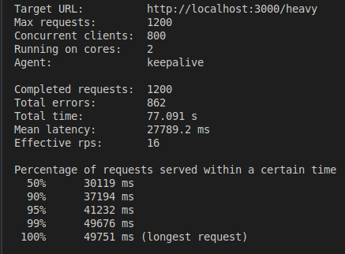
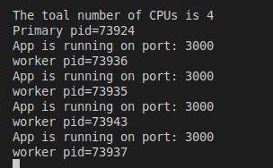
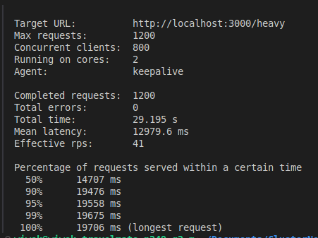

# Cluster-Node

This simple project tutorial is the implementation of cluster in Node Js for improved performance.

## Understanding Clustering

Clustering in Node.js involves creating multiple worker processes that share the incoming workload. Each worker process runs in its own event loop, utilizing the available CPU cores. The master process manages the worker processes, distributes incoming requests, and handles process failures.

## Benefits of Clustering:

### 1. Improved Performance

### 2. Scalability

### 3. Fault Tolerance

## While LoadTesting Before Using Cluster

## Using Cluster

#### By using the built-in `cluster` module, the workload is divided into 4 worker processes, corresponding to the number of CPU cores.

## While LoadTesting After Using Cluster

